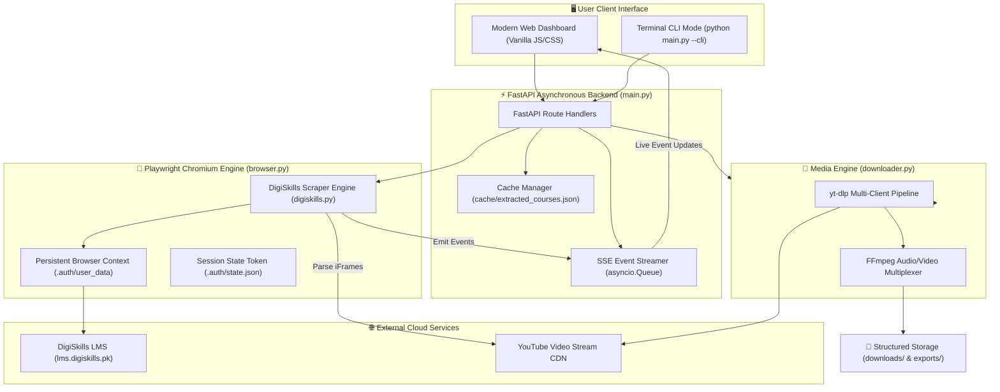
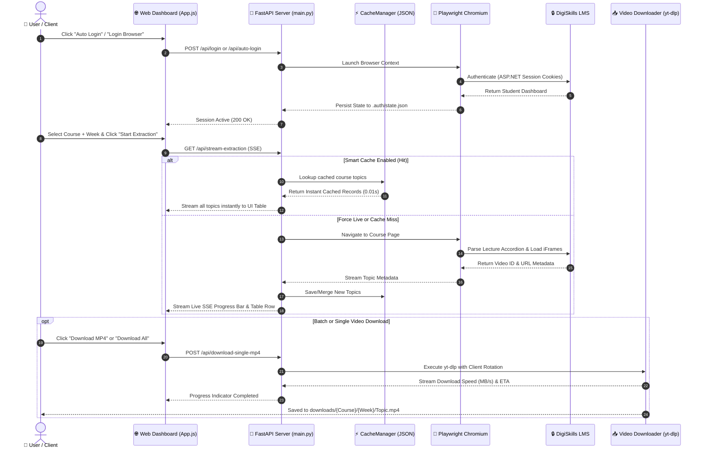

<div align="center">

# 🚀 DigiSkills Video Links Extractor & Downloader
### *Enterprise-Grade Automated LMS Scraping, Video Extraction & Batch Downloader Suite*

[](https://www.python.org/)
[](https://fastapi.tiangolo.com/)
[](https://playwright.dev/python/)
[](https://github.com/yt-dlp/yt-dlp)
[](https://pandas.pydata.org/)
[](https://opensource.org/licenses/MIT)

<p align="center">
  <b>A high-performance, asynchronous web automation and link extraction system designed to parse, index, preview, and download course video streams from DigiSkills LMS into structured datasets and high-definition MP4 files.</b>
</p>

[✨ Live Features](#-key-features--capabilities) •
[🏗️ Architecture](#️-system-architecture--workflow-diagrams) •
[⚡ Quick Start](#-quick-start--installation) •
[🎯 Use Cases](#-real-world-use-cases--business-value) •
[📊 Data Formats](#-extracted-data--export-formats) •
[💼 Hire Me](#-available-for-hire--custom-development)

---

</div>

## 🌟 Executive Overview

**DigiSkills Video Links Extractor** is a production-ready automation platform engineered to solve the challenge of extracting structured metadata and direct video stream links from complex, authenticated ASP.NET WebForms Learning Management Systems.

Built with an **Asynchronous Python Core (FastAPI + Playwright)** and paired with a **Cyber-Glassmorphism Web Dashboard**, this tool seamlessly bypasses anti-bot heuristics, navigates dynamic batch accordions, extracts embedded YouTube/stream iFrames, caches topic indexes for 0-second instant retrieval, and downloads video media across customizable quality resolutions (1080p, 720p, 480p, 360p, or Audio).

> [!TIP]
> **Looking for Freelance Automation or Web Scraping Solutions?**  
> This project highlights modern Python design patterns, resilient web-scraping architecture, concurrent async pipelines, and intuitive UI design. [**Reach out for custom development inquiries!**](#-available-for-hire--custom-development)

---

## 💎 Why This Project Stands Out (Engineering Highlights)

| Feature Pillar | Technical Implementation | Business & Developer Value |
| :--- | :--- | :--- |
| **🛡️ Anti-Bot & Session Resilience** | Persistent browser contexts, headless/headful hybrid state storage (`.auth/state.json`), automated token reload. | Eliminates session disconnects; handles 2FA and CAPTCHA effortlessly. |
| **⚡ Real-Time SSE Streaming** | Asynchronous Server-Sent Events (`/api/stream-extraction`) with `asyncio.Queue` event dispatching. | Instant live progress feedback, topic-by-topic rendering, zero page refreshes. |
| **🏎️ Zero-Latency Hybrid Caching** | Fine-grained JSON cache manager with multi-tier key normalization and live-sync merge. | Drops extraction time from minutes to **0.05 seconds** for previously indexed courses. |
| **🎬 Multi-Client Video Engine** | `yt-dlp` integrated with `imageio-ffmpeg`, rotating player clients (`android_vr`, `ios`, `web`) to beat HTTP 403s. | Guaranteed video downloading with auto-retry and multi-resolution encoding. |
| **📑 Professional Multi-Format Export** | `pandas` + `openpyxl` formatting with native clickable hyperlinks in Excel, UTF-8-SIG CSV, JSON, and ASCII Text. | Ready for immediate ingestion by data scientists, educators, and archiving systems. |
| **🎨 Cyber-Glass Dashboard & CLI** | Responsive Vanilla CSS/JS dashboard with real-time speedometers + standalone CLI tool. | No bulky Node.js build dependencies required; runs anywhere with Python. |

---

## 🏗️ System Architecture & Workflow Diagrams

### 1. End-to-End Extraction & Streaming Pipeline



---

### 2. Session Authentication & Extraction Lifecycle



---

## ✨ Key Features & Capabilities

### 🔐 1. Smart Session & Anti-Bot Engine
- **One-Click Auto Login**: Securely logs in using credentials provided in `.env`.
- **Interactive Headful Mode**: Built-in popup browser for 2FA, SMS verification, or CAPTCHA resolution.
- **Session Persistence**: Stores session tokens in `.auth/state.json` and persistent profile directories for seamless subsequent restarts.
- **Auto-Logout & Cache Reset**: One-click session invalidation and cookie purging.

### ⚡ 2. High-Performance Hybrid Caching
- **Instant 0-Second Retrieval**: Automatically detects and loads previously scraped courses from `cache/extracted_courses.json`.
- **Row-Level Merging**: Scrapes only newly unlocked weeks or missing topics, merging them into existing caches without duplicate requests.
- **Force Live Switch**: Toggle between ultra-fast Smart Cache mode and 100% fresh live scraping.

### 🎥 3. Multi-Resolution Video Downloader
- **Quality Preset Selection**: Download in **1080p Full HD**, **720p HD**, **480p SD**, **360p Compact**, **Best Available**, or **Audio Only (M4A)**.
- **Client Fallback Rotation**: Uses rotating clients (`android_vr`, `web_creator`, `ios`, `mweb`, `web`) to bypass YouTube 403 Forbidden throttling.
- **Live Progress & Speedometer**: Real-time download progress with download percentage, speed in MB/s, and accurate ETA.
- **Automated Directory Organization**: Standardizes file names and organizes videos cleanly:  
  `downloads/{Course_Name}/{Week_Number}/Topic 001 - {Topic_Title}.mp4`

### 📊 4. Comprehensive Multi-Format Exporter
- **Excel Spreadsheet (`.xlsx`)**: Generates structured sheets with **clickable hyperlinks** using `openpyxl`.
- **CSV Data Sheet (`.csv`)**: Formatted with `utf-8-sig` encoding for universal compatibility with Microsoft Excel, Google Sheets, and Pandas.
- **JSON Object Store (`.json`)**: Formatted, indented JSON schema ready for database seeding or API pipelines.
- **ASCII Text Report (`.txt`)**: Clean, human-readable summary grouped week-by-week.

---

## 🎯 Real-World Use Cases & Business Value

```
┌─────────────────────────────────────────────────────────────────────────────┐
│                            PRIMARY USE CASES                                │
├──────────────────────────────┬──────────────────────────────┬───────────────┤
│ 🎓 Education & Students      │ 🏢 EdTech & Migration        │ 📊 Data & SEO │
├──────────────────────────────┼──────────────────────────────┼───────────────┤
│ • Offline study archives     │ • Content ingestion for LMS  │ • Curriculum  │
│ • Low-bandwidth buffering    │ • Course taxonomy indexing   │   analytics   │
│ • Personal learning backups  │ • Automated QA & link check  │ • Topic audit │
└──────────────────────────────┴──────────────────────────────┴───────────────┘
```

1. **Offline E-Learning & Accessibility**: Enables students in areas with unstable internet connectivity to queue and download high-definition course materials for uninterrupted offline study.
2. **EdTech Content Migration & Backup**: Allows educational institutions to audit, export, and migrate course catalogs, video indexes, and topic structures into centralized LMS platforms (Moodle, Canvas, Blackboard).
3. **Data Science & Curriculum Analysis**: Extracts syllabus structures, video durations, and progression paths to benchmark online training programs and analyze instructional pacing.
4. **Automated Link Validation & QA**: Continuously verifies video availability, identifies missing or locked lecture links, and ensures educational platform health.

---

## 📁 Repository Structure

```
Link Extractor/
│
├── 📄 main.py                   # FastAPI server entry point, REST endpoints, and CLI runner
├── 📄 requirements.txt          # Python dependencies (Playwright, FastAPI, yt-dlp, Pandas, etc.)
├── 📄 .env.example              # Template configuration file for credentials and ports
├── 📄 login.bat                 # Windows quick-launcher script for interactive login
├── 📄 README.md                 # Project documentation and master manual
│
├── 📂 extractor/                # Core Python automation and scraping package
│   ├── 🐍 __init__.py           # Package initializer
│   ├── 🐍 browser.py            # Playwright browser manager & persistent context handler
│   ├── 🐍 cache_manager.py      # Hybrid JSON cache engine for 0-second loading
│   ├── 🐍 digiskills.py         # DigiSkills LMS parser, topic extractor & DOM traverser
│   ├── 🐍 downloader.py         # yt-dlp video downloader with multi-client 403 bypass
│   ├── 🐍 exporter.py           # Multi-format data exporter (Excel, CSV, JSON, TXT)
│   └── 🐍 login_window.py       # Standalone headful login window script
│
├── 📂 web/                      # Cyber-Glassmorphism Frontend Dashboard
│   ├── 🌐 index.html            # Dashboard markup, modal players & control panels
│   ├── 🎨 styles.css            # Custom CSS3 theme (glassmorphism, animations, responsive grid)
│   └── ⚡ app.js                # Frontend state management, SSE listener & dynamic UI
│
├── 📂 docs/                     # In-depth technical documentation
│   ├── 📖 GETTING_STARTED.md    # Step-by-step installation, virtual environment & setup
│   ├── 📖 WORKFLOW_AND_EXAMPLES.md # Sequence diagrams, sample payloads & data schemas
│   └── 📖 TROUBLESHOOTING.md    # Diagnostic handbook & solutions for common errors
│
├── 📂 .auth/                    # [Auto-Generated] Session cookies and persistent browser state
├── 📂 cache/                   # [Auto-Generated] Local cache store for extracted courses
├── 📂 exports/                 # [Auto-Generated] Exported CSV, Excel, JSON, and TXT files
└── 📂 downloads/               # [Auto-Generated] Downloaded course videos sorted by week
```

---

## ⚡ Quick Start & Installation

### 1. Prerequisites
- **Python 3.10 or higher** installed ([Download Python](https://www.python.org/downloads/))
- **Git** installed on your system
- Valid DigiSkills LMS student credentials

---

### 2. Clone & Setup Virtual Environment

```bash
# 1. Clone the repository
git clone https://github.com/zeeshansq/linkextractor.git
cd linkextractor

# 2. Create Python virtual environment
python -m venv venv

# 3. Activate virtual environment
# Windows (PowerShell):
.\venv\Scripts\Activate.ps1
# Windows (CMD):
venv\Scripts\activate.bat
# Linux / macOS / Git Bash:
source venv/Scripts/activate
```

---

### 3. Install Dependencies & Browser Engine

```bash
# Install Python packages
pip install -r requirements.txt

# Install Playwright's Chromium browser binary
playwright install chromium
```

---

### 4. Configure Environment Credentials (`.env`)

Copy `.env.example` to `.env` and fill in your credentials:

```bash
cp .env.example .env
```

Edit `.env`:
```env
# DigiSkills LMS Account Credentials
DIGISKILLS_EMAIL=your_email@example.com
DIGISKILLS_PASSWORD=your_password_here

# LMS Endpoints
DIGISKILLS_LOGIN_URL=https://lms.digiskills.pk/Login.aspx
DIGISKILLS_DASHBOARD_URL=https://lms.digiskills.pk/Dashboard.aspx

# App Server Settings
PORT=8000
HEADLESS=true
```

---

### 5. Launch the Application

#### Option A: Interactive Web UI (Recommended)
```bash
python main.py --port 8000
```
Open your browser and navigate to:  
👉 **`http://localhost:8000`**

#### Option B: Terminal CLI Mode
```bash
python main.py --cli
```

---

## 📊 Extracted Data & Export Formats

### 1. JSON Schema Output (`exports/{Course_Name}.json`)
```json
[
  {
    "course_name": "Graphic Design (Batch-01)",
    "week": "Week 01",
    "lecture_number": 1,
    "topic_title": "Topic 001 - Introduction to Graphic Design",
    "youtube_url": "https://www.youtube.com/watch?v=dQw4w9WgXcQ",
    "video_id": "dQw4w9WgXcQ",
    "embed_url": "https://www.youtube.com/embed/dQw4w9WgXcQ",
    "thumbnail_url": "https://img.youtube.com/vi/dQw4w9WgXcQ/hqdefault.jpg",
    "duration": "00:12:45",
    "status": "extracted",
    "source": "live"
  },
  {
    "course_name": "Graphic Design (Batch-01)",
    "week": "Week 05",
    "lecture_number": 22,
    "topic_title": "Topic 022 - Advanced Typography Rules",
    "youtube_url": "Locked (Future Week)",
    "video_id": "N/A",
    "embed_url": "N/A",
    "thumbnail_url": "",
    "duration": "00:15:10",
    "status": "locked_week",
    "source": "live"
  }
]
```

### 2. Formatted Excel Output (`exports/{Course_Name}.xlsx`)
- Includes structured columns: `course_name`, `week`, `lecture_number`, `topic_title`, `youtube_url`, `duration`, and `status`.
- **Clickable Hyperlinks**: Direct YouTube links are formatted with native blue underlines for instant one-click browser playback from inside Microsoft Excel.

### 3. Human-Readable ASCII Report (`exports/{Course_Name}.txt`)
```text
================================================================================
                    DIGISKILLS LMS LECTURE LINKS REPORT
================================================================================
Course Title: Graphic Design (Batch-01)
Total Lectures Extracted: 48
================================================================================

[Week 01]
================================================================================
Lecture #1: Topic 001 - Introduction to Graphic Design
  • Duration:    00:12:45
  • YouTube URL: https://www.youtube.com/watch?v=dQw4w9WgXcQ
--------------------------------------------------------------------------------
Lecture #2: Topic 002 - Understanding Adobe Illustrator Tools
  • Duration:    00:18:20
  • YouTube URL: https://www.youtube.com/watch?v=3JZ_D3ELDeg
--------------------------------------------------------------------------------
```

---

## 📡 REST API Reference

The backend exposes a clean, documented asynchronous REST API:

| Method | Endpoint | Description | Query / Body Parameters |
| :---: | :--- | :--- | :--- |
| `GET` | `/api/status` | Instant session status check | None |
| `POST` | `/api/login` | Spawns interactive headful login browser | None |
| `POST` | `/api/auto-login` | Executes automated headless login | None (`.env` credentials) |
| `POST` | `/api/logout` | Clears active session & purges cookies | None |
| `GET` | `/api/courses` | Retrieves all active and previous enrolled courses | None |
| `GET` | `/api/course-weeks` | Returns available weeks for selected course | `button_id`, `course_title` |
| `GET` | `/api/stream-extraction` | Initiates real-time SSE extraction stream | `course_title`, `button_id`, `target_week`, `force_live` |
| `POST` | `/api/stop` | Halts currently running extraction | None |
| `POST` | `/api/download-single-mp4` | Downloads single video with progress tracking | `{ youtube_url, course_name, week, topic_title, quality }` |
| `GET` | `/api/scan-downloads-folder`| Returns list of all downloaded MP4 files on disk | None |
| `GET` | `/api/open-downloads-folder`| Opens local `downloads/` folder in OS File Explorer | None |
| `GET` | `/api/export/{format}` | Downloads exported file (`excel`, `csv`, `json`, `txt`) | None |

---

## 🛠️ Diagnostics & Troubleshooting

| Symptom | Cause | Solution |
| :--- | :--- | :--- |
| **Port 8000 Conflict** | Another process is using port 8000 | Launch with `--port 9000` (`python main.py --port 9000`) |
| **Playwright Driver Missing** | Chromium binaries not downloaded | Run `playwright install chromium` in active virtualenv |
| **Session Expired / Not Logged In** | Cookies invalidated by LMS | Click **"Login Browser"** on dashboard, complete login, and fetch courses |
| **PowerShell Script Policy Block** | Windows execution policy restriction | Run `Set-ExecutionPolicy -ExecutionPolicy RemoteSigned -Scope Process` |
| **YouTube 403 Forbidden** | YouTube rate-limiting / bot block | Downloader automatically rotates to `android_vr` / `ios` client fallback |

> [!NOTE]
> For complete diagnostic instructions, refer to the **[Troubleshooting Guide](file:///c:/py-projects/Link%20Extractor/docs/TROUBLESHOOTING.md)**.

---

## 🗺️ Roadmap & Future Enhancements

- [x] Full Playwright anti-bot integration and session persistence
- [x] Asynchronous Server-Sent Events (SSE) live progress streaming
- [x] Smart hybrid caching for 0-second instantaneous course loading
- [x] Integrated `yt-dlp` video downloader with multi-resolution format selector
- [x] In-browser video player modal with responsive controls
- [ ] Multi-threaded concurrent video downloading queue
- [ ] Auto-transcription & AI lecture summarization pipeline (Whisper + Gemini)
- [ ] Automated Google Drive / S3 cloud sync for course backups
- [ ] Docker containerization with pre-configured Playwright headless runtime

---

## 💼 Available for Hire & Custom Development

### 👋 Need a custom automation pipeline, web scraper, or full-stack software application?

I specialize in architecting robust, resilient, and enterprise-grade Python software, automated data extraction engines, and modern responsive web applications.

#### 🛠️ Core Competencies:
- **Web Scraping & Browser Automation**: Playwright, Puppeteer, Selenium, anti-bot bypass (Cloudflare, CAPTCHA, ASP.NET WebForms).
- **Backend Architecture & APIs**: Python, FastAPI, Flask, Django, Node.js, AsyncIO, Server-Sent Events (SSE), WebSockets.
- **Data Engineering & Pipelines**: Pandas, NumPy, OpenPyXL, automated ETL pipelines, batch data migration.
- **Frontend & UI/UX Design**: Modern Vanilla JS/CSS, Cyber-Glassmorphism, React, TailwindCSS, interactive data tables.
- **DevOps & Integration**: Docker, CI/CD pipelines, Git, Linux server deployment.

---

<div align="center">

### 📬 Connect With Me

[](https://github.com/zeeshansq)
[](https://www.linkedin.com/in/zeeshansq)
[](https://wa.me/923155754436)
[](mailto:zeeshan.shabbirqureshi@gmail.com)

<br/>

**⭐ If you found this project helpful, please consider starring the repository! ⭐**

<sub>Copyright © 2026 • Designed & Built with ❤️ for the Developer Community</sub>

</div>
