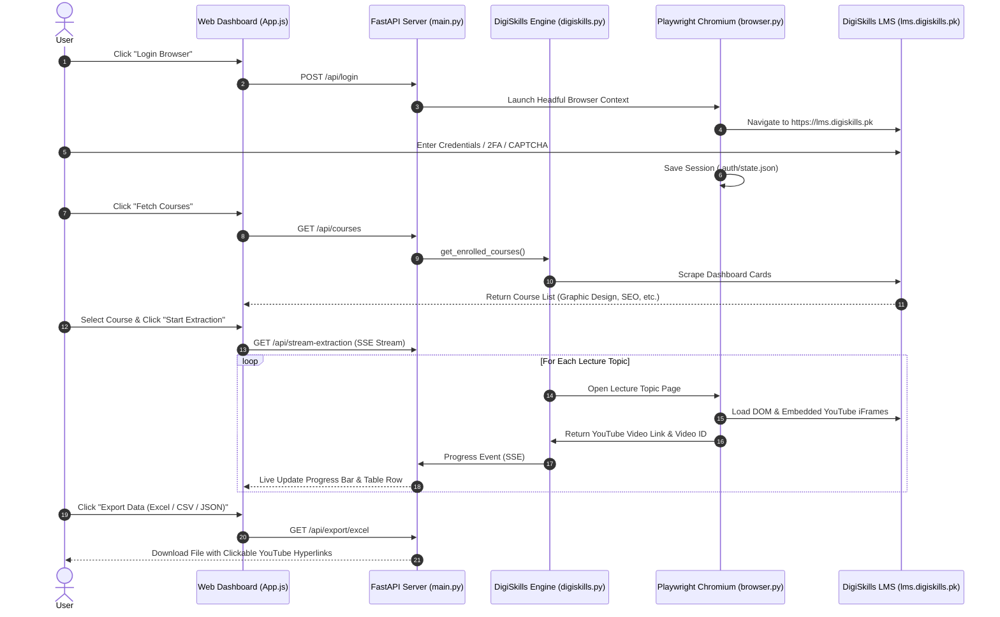

# 🔄 Workflow Architecture & Working Examples

This document details the complete operational lifecycle of **DigiSkills Video Links Extractor** along with real-world output examples in JSON, CSV, and Excel formats.

---

## 🏗️ System Workflow Architecture



---

## 📝 Working Example: Extracted Lecture Data Output

Below are actual output format specifications generated by the extractor.

### 1. JSON Export Example (`exports/digiskills_lectures.json`)

```json
[
  {
    "course_name": "Mobile Game and App Development (Week 2/12)",
    "week": "Week 01",
    "lecture_number": 1,
    "topic_title": "1 - Introduction to Flutter",
    "youtube_url": "https://www.youtube.com/watch?v=8yQIL5xQCGQ",
    "video_id": "8yQIL5xQCGQ",
    "embed_url": "https://www.youtube.com/embed/8yQIL5xQCGQ",
    "thumbnail_url": "https://img.youtube.com/vi/8yQIL5xQCGQ/hqdefault.jpg",
    "duration": "00:08:33",
    "status": "extracted"
  },
  {
    "course_name": "Mobile Game and App Development (Week 2/12)",
    "week": "Week 05",
    "lecture_number": 14,
    "topic_title": "14 - State Management in Flutter",
    "youtube_url": "Locked (Week Disabled)",
    "video_id": "N/A",
    "embed_url": "N/A",
    "thumbnail_url": "",
    "duration": "00:12:10",
    "status": "locked_week"
  }
]
```

---

### 2. CSV Export Example (`exports/digiskills_lectures.csv`)

```csv
course_name,week,lecture_number,topic_title,youtube_url,video_id,embed_url,thumbnail_url,duration,status
Mobile Game and App Development (Week 2/12),Week 01,1,1 - Introduction to Flutter,https://www.youtube.com/watch?v=8yQIL5xQCGQ,8yQIL5xQCGQ,https://www.youtube.com/embed/8yQIL5xQCGQ,https://img.youtube.com/vi/8yQIL5xQCGQ/hqdefault.jpg,00:08:33,extracted
Mobile Game and App Development (Week 2/12),Week 05,14,14 - State Management in Flutter,Locked (Week Disabled),N/A,N/A,,00:12:10,locked_week
```

---

### 3. Live Dashboard Output Table Preview

```
+---+--------------------------------------------+---------------------------------------------+----------+-----------+
| # | Lecture Topic Title                        | YouTube Video Link                          | Duration | Actions   |
+---+--------------------------------------------+---------------------------------------------+----------+-----------+
| 1 | Topic 001 - Intro to Photoshop Workspace   | 🔴 https://www.youtube.com/watch?v=dQw4w9W  | 12:45    | [ Copy ]  |
| 2 | Topic 002 - Understanding Layers & Masks   | 🔴 https://www.youtube.com/watch?v=3JZ_D3E  | 18:20    | [ Copy ]  |
| 3 | Topic 003 - Color Theory Principles        | 🔴 https://www.youtube.com/watch?v=L_jWHff  | 15:10    | [ Copy ]  |
+---+--------------------------------------------+---------------------------------------------+----------+-----------+
```

> [!TIP]
> **Excel Feature**: The exported Excel `.xlsx` file automatically converts YouTube URLs into clickable hyperlinks styled with native blue underlined text!
